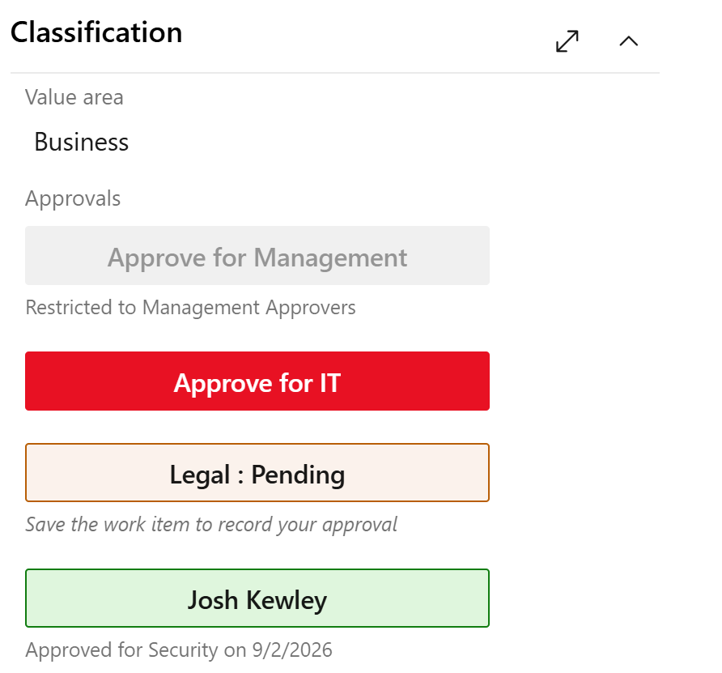

# Work Item Group Approval

Add sign-off buttons directly to your Azure Boards work item. Each button lets a designated person record approval on behalf of a named group - IT, QA, Business, Legal, or any group you define. Approvals can be **restricted to members of a named Azure DevOps team**, and each button can be **shown or hidden based on the value of another field** so approval steps only appear when they apply. The extension captures who approved, for which group, and when, and stores everything in real work item fields that you can query, filter, and report on.

## What it does

Each control you add to a work item layout renders as a single button. Before anyone has approved, the button reads **Approve for \<Group name\>** in red, making it obvious that sign-off is outstanding. Once clicked:

- The work item must be saved to record the approval. While the save is pending the button shows **\<Group name\> : Pending** in amber as a reminder.
- After the work item is saved, the approver sees **Reset Approval** in blue so they can undo if needed. Members of the configured admin team can also reset on their behalf.
- Everyone else sees the approver's display name in green, with a caption showing which group was approved and the date.

Stack multiple controls in one column - one per group - and each operates independently. A form column might show IT, QA, and Business approvals side by side, each with its own status at a glance.

Restrict each button to members of a named Azure DevOps team - anyone outside that team sees the approval as read-only and cannot click it. Buttons can also be shown or hidden based on the value of another field on the same work item, so approval steps only appear when they apply and never clutter the form otherwise.

## Why use it

- **Stays inside Azure Boards** - no separate tool, no email chain, no spreadsheet to maintain.
- **Queryable** - approvals live in standard work item fields, so you can filter backlogs, build dashboard queries, and use Analytics just like any other field.
- **Auditable** - every approval and reset is recorded in the work item history with a timestamp and the identity of who made the change.
- **Respects your theme** - the control picks up your organization's light, dark, or high-contrast theme automatically.
- **Accessible** - screen readers get a full descriptive label ("Approved by … for … on …") rather than just a person's name.

## Prerequisites

Before adding the control to a form, create the backing fields in your **inherited process**:

| Field | Type | Suggested reference name |
| --- | --- | --- |
| Approver | Identity | `Custom.<Group>Approver` - e.g. `Custom.ITApprover` |
| Approved on *(optional)* | Date/Time | `Custom.<Group>ApprovedOn` - e.g. `Custom.ITApprovedOn` |

Create one set of fields per group. Add each field to the work item types that need approval, then proceed to installation.

## Configuration

For each group that needs an approval button:

1. Go to **Project settings → Process → \<your process\> → \<work item type\> → Layout**.
2. Choose **Add custom control** and select **Group Approval**.
3. Fill in the control inputs:

| Input | Required | Description |
| --- | --- | --- |
| Group name | Yes | Label for the group, e.g. `IT`. Shown on the button as "Approve for IT". |
| Approver field | Yes | The Identity field that records who approved, e.g. `Custom.ITApprover`. |
| Approved on field | No | A Date/Time field that records when approval was given, e.g. `Custom.ITApprovedOn`. |
| Approver team | No | Name of an ADO team (from Project Settings → Teams) whose members may approve. Leave blank to allow anyone to approve. |
| Admin team | No | Name of an ADO team whose members may reset any approval, not just their own. Leave blank to allow only the original approver to reset. |
| Visibility field | No | A work item field that controls whether the button is shown at all. Leave blank to always show the button. |
| Visibility value | No | The value the visibility field must equal for the button to appear. Comparison is case-insensitive. |

4. In the layout editor's own **Label** field for the control, set a heading such as `Approvers` on the *first* control of a stack. Leave it blank on any subsequent controls so they sit tight beneath the first.
5. Repeat for each additional group.

## Conditional visibility example: Emergency Release approvals

Some approval steps only apply to certain kinds of work items. For example, an organization might require a dedicated approval for emergency releases but not for standard ones.

**Scenario:** A custom `Release Type` picklist field (reference name `Custom.ReleaseType`) controls the kind of release. When it is set to `Emergency`, a separate emergency approval button must appear and be signed off before the release can proceed. For standard releases, the button should be invisible so it does not clutter the form.

**Setup:**

1. Create a custom picklist field `Custom.ReleaseType` with values including `Standard` and `Emergency`.
2. Create a backing identity field `Custom.EmergencyApprover` for the approval.
3. Add a **Group Approval** control to the layout with:
   - **Group name:** `Emergency`
   - **Approver field:** `Custom.EmergencyApprover`
   - **Visibility field:** `Custom.ReleaseType`
   - **Visibility value:** `Emergency`

The button now appears only when `Release Type` is `Emergency`. As soon as someone changes the field to `Standard`, the button disappears - no empty space, no "N/A" state. Changing it back to `Emergency` brings the button back immediately, without saving the work item first.

## Who can reset an approval?

Once a work item is saved with an approval recorded, two groups of people can reset it:

- The person who clicked the button.
- Any member of the **Admin team** configured on that control (optional - if none is set, only the original approver can reset).

Everyone else sees the approval as read-only. This is enforced in the control UI. Because Azure DevOps has no server-side work item rule that locks a field to a specific identity, the underlying field can still be edited via the REST API or bulk edit by users with edit permission - every such change is recorded in the work item history as an audit trail.

## Permissions requested

| Scope | Purpose |
| --- | --- |
| `vso.work_write` | Read and write the approval fields on the work item form. |
| `vso.project` | Read the current user's ADO team memberships to enforce approver and admin team restrictions. |
